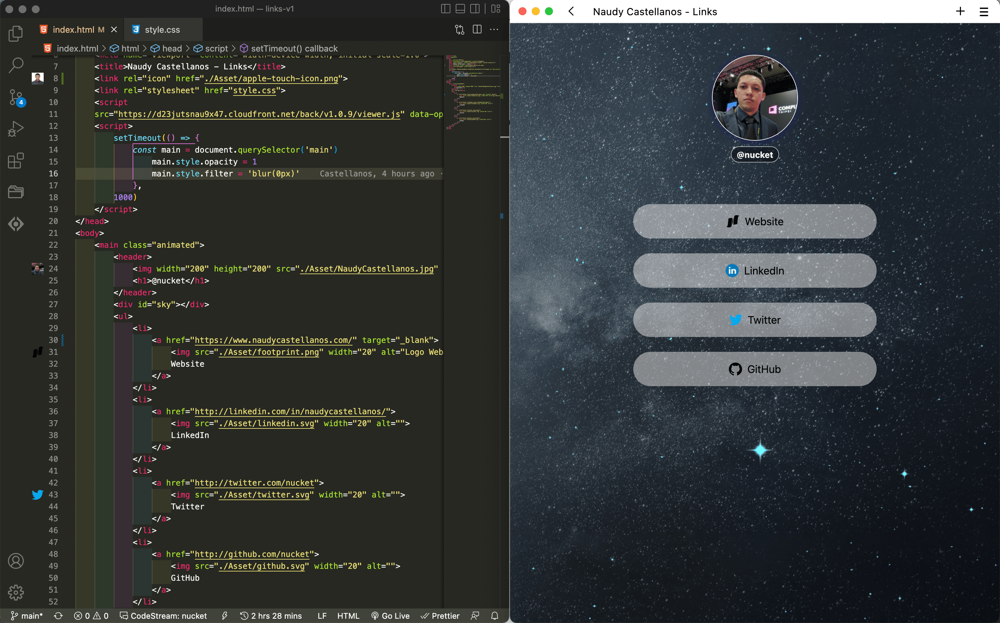

# links-v1 [NaudyCastellanos.com](https://www.naudycastellanos.com)

Visual [

## Project structure

```
$PROJECT_ROOT
│   # Entre point
├── index.html
│   # Style sheets
├── style.css
│   # Images and other file
└── asset
```

## Project ingredients

- HTML - HyperText Markup language
- CSS - Cascading Style Sheets
- JavaScript - A scripting language for web pages
- Naker.back - Animate Backgrounds

____

## Changes to version 1a

- Added the sounds to the links
- Added shortcuts to links
- Added lock to context menu
- Added a visual of the result to the Readme.md

___


## License

MIT License.
